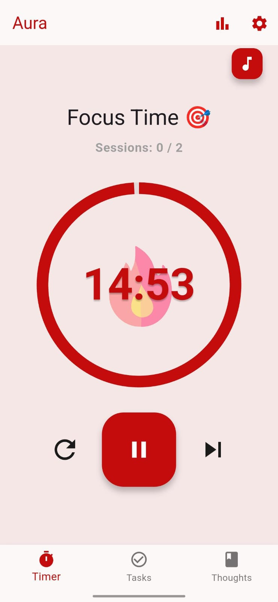
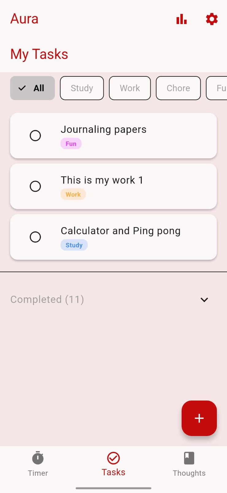
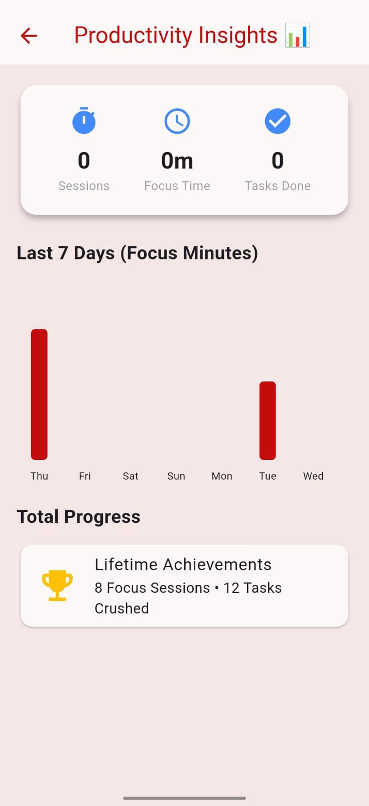
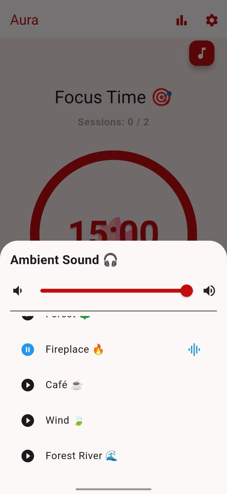
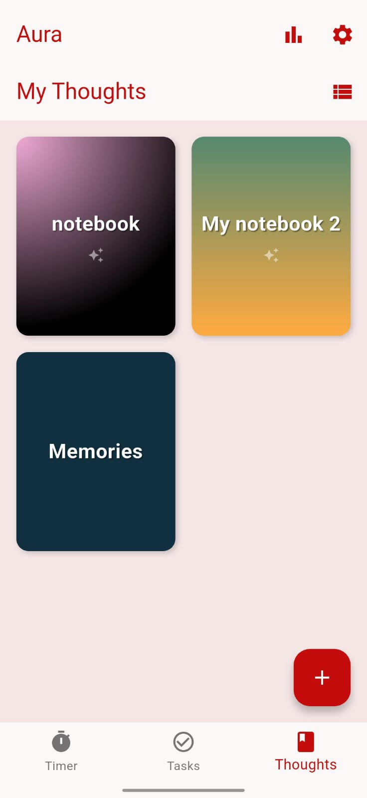
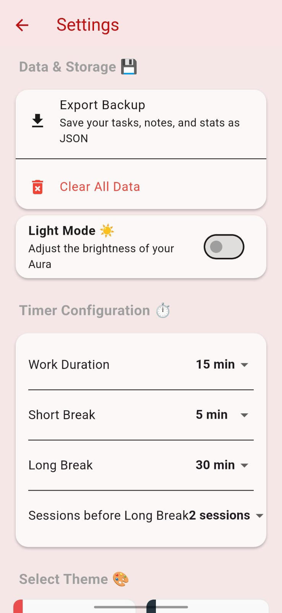

# 🌟 Aura v2.0

**Aesthetic Productivity Suite built with Flutter**

> Focus. Feel. Flow.
> A productivity app that blends Pomodoro discipline with emotional design.

---

## 📱 Overview

Aura v2.0 transforms productivity into an immersive experience.

Instead of being just another timer + tasks app, Aura integrates:

* 🎧 Ambient focus soundscapes
* 📝 Creative journaling with draggable stickers
* 📊 Visual productivity analytics
* ✨ Animated, theme-driven timer sessions

Built fully in **Flutter (Dart)** with an offline-first architecture prioritizing privacy and performance.

---

## 🚀 Core Features

### 🎧 Ambient Sound Engine

* Seamless looping audio (Rain, Forest, Fire, Café)
* Volume slider + persistent state
* Powered by `audioplayers`

---

### 📝 Creative Journaling

* Stack-based layered notebook canvas
* 40+ draggable, scalable, rotatable stickers
* Gesture-controlled pinch & rotate logic
* JSON-based persistence of sticker coordinates

---

### ⏳ Immersive Pomodoro Timer

* Lottie-powered theme animations
* 80+ theme-specific reward quotes
* Automatic stat logging after session completion

---

### 📊 Productivity Dashboard

* Weekly focus chart using `fl_chart`
* Lifetime statistics tracking
* Daily summaries
* Offline JSON-based logging system

---

### 🗂️ Smart Task Management

* Category tagging (Study, Work, Chore, Fun)
* Color-coded chips
* Horizontal filter bar
* Completed-task separation

---

## 🏗 Technical Architecture

**State Management**

* MultiProvider architecture
* Separate providers for Timer, Sound, Stats, Theme

**Data Persistence**

* SharedPreferences with custom JSON adapters
* Nested object handling (sticker layers, daily maps)

**Performance Optimizations**

* AutomaticKeepAliveClientMixin for tab state retention
* Asset pre-caching (audio + animations)
* Safe native initialization with try-catch wrappers

**Native Integration**

* Android notifications service

---

## 📂 Project Structure

```
lib/
 ├── main.dart
 ├── pages/
 ├── providers/
 ├── models/
 └── services/
```

Modular separation of UI, logic, and data layers.

---

## 🛠 Tech Stack

* Flutter (Dart)
* Provider (State Management)
* audioplayers
* fl_chart
* Lottie
* SharedPreferences
* Native Android Integration

---

## 📦 Installation

```bash
git clone https://github.com/HumaisJ/aura-v2.git
cd aura-v2
flutter pub get
flutter run
```

---

## 🔮 Future Roadmap

* Cloud sync (Firebase)
* Google Calendar integration
* AI-powered journaling insights

---

## 🧠 What This Project Demonstrates

* Advanced Flutter UI layering
* Complex gesture handling
* Modular architecture design
* Data persistence with nested JSON structures
* Performance-conscious engineering

---

## 📸 Screenshots









---
